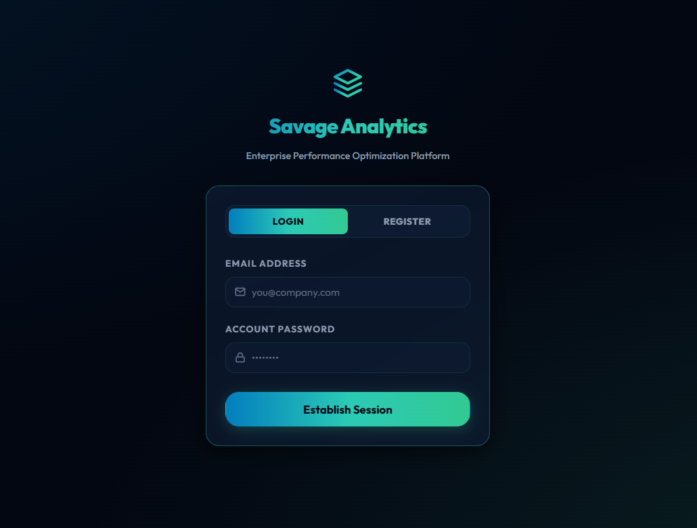
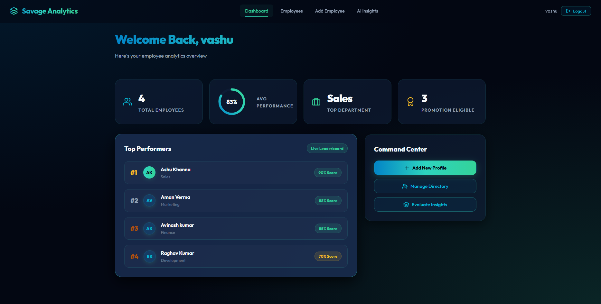
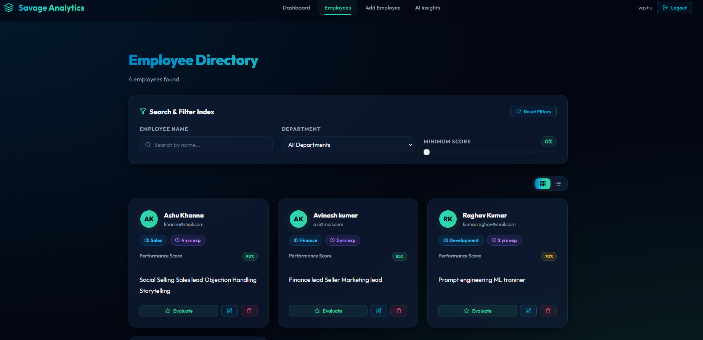
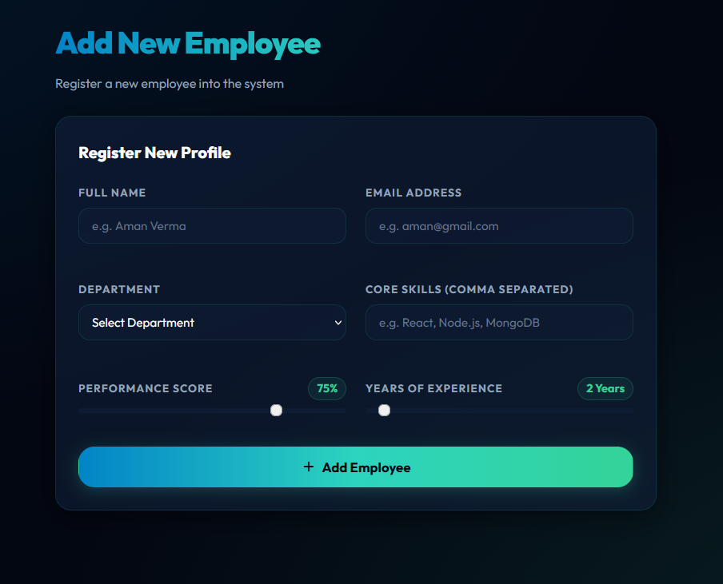
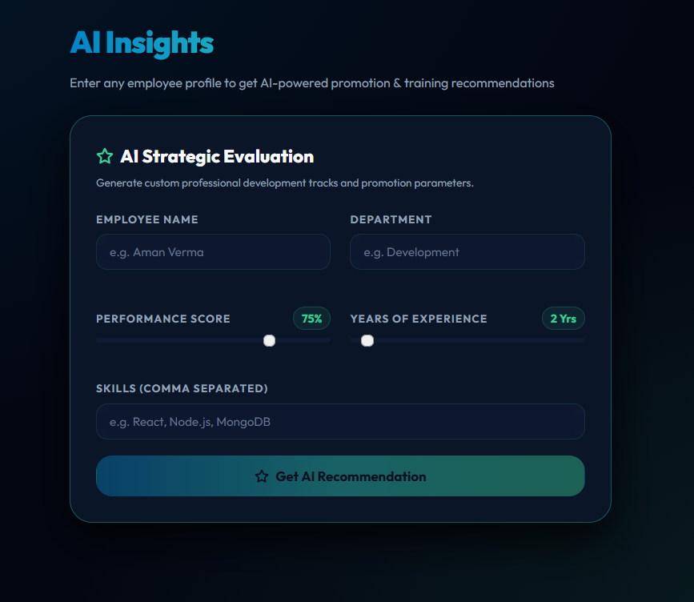

# AI-Based Employee Performance Analytics & Recommendation System

A full-stack MERN application that analyzes employee performance data and provides AI-powered recommendations using the OpenRouter API.

## Features

- **Employee Management** — Add, view, update, and delete employees
- **Search & Filter** — Filter by department, name, and performance score
- **AI Recommendations** — Get promotion, training, and feedback suggestions via AI
- **Employee Ranking** — Rank employees by performance score
- **Authentication** — JWT-based login/signup with bcrypt password hashing
- **Protected Routes** — All API endpoints secured with JWT middleware

## Tech Stack

| Layer | Technology |
|----------|-----------|
| Frontend | React + Vite, React Router, Axios |
| Backend | Node.js, Express.js |
| Database | MongoDB + Mongoose |
| Auth | JWT + bcryptjs |
| AI | OpenRouter API (OpenAI-compatible) |
| Deploy | Render (Frontend + Backend) + MongoDB Atlas |

## System Interface & Previews

Below are visual previews of the **Savage Analytics** enterprise platform:

| Authentication Screen | Dynamic Analytics Dashboard |
|:---:|:---:|
|  |  |

| Employees Directory | Add Employee Form |
|:---:|:---:|
|  |  |

| AI-Powered Recommendations |
|:---:|
|  |

## Project Structure

```
AI_FSD_ESE/
├── client/ # React frontend (Vite)
│ ├── src/
│ │ ├── api/ # Axios instance
│ │ ├── components/ # Reusable components
│ │ ├── context/ # Auth context
│ │ └── pages/ # Page components
├── server/ # Node.js + Express backend
│ ├── controllers/ # Business logic
│ ├── middleware/ # JWT auth middleware
│ ├── models/ # Mongoose schemas
│ └── routes/ # API route definitions
```

## Setup & Installation

### 1. Clone the repository
```bash
git clone <your-repo-url>
cd AI_FSD_ESE
```

### 2. Configure environment variables

**Backend** — edit `server/.env`:
```env
MONGO_URI=your_mongodb_atlas_connection_string
JWT_SECRET=your_jwt_secret_key
OPENROUTER_API_KEY=your_openrouter_api_key
PORT=5000
```

**Frontend** — edit `client/.env`:
```env
VITE_API_URL=http://localhost:5000/api
```

### 3. Install dependencies & run

```bash
# Install backend deps
npm install

# Install frontend deps
cd client && npm install && cd ..

# Run both (in separate terminals)
npm run dev # Backend: http://localhost:5000
cd client && npm run dev # Frontend: http://localhost:5173
```

## API Endpoints

### Auth
| Method | Endpoint | Description |
|--------|----------|-------------|
| POST | `/api/auth/register` | Create account |
| POST | `/api/auth/login` | Login → get JWT |
| GET | `/api/auth/me` | Get current user () |

### Employees
| Method | Endpoint | Description |
|--------|----------|-------------|
| POST | `/api/employees` | Add employee () |
| GET | `/api/employees` | Get all employees () |
| GET | `/api/employees/search?department=X` | Search/filter () |
| PUT | `/api/employees/:id` | Update employee () |
| DELETE | `/api/employees/:id` | Delete employee () |

### AI
| Method | Endpoint | Description |
|--------|----------|-------------|
| POST | `/api/ai/recommend` | Get AI recommendation () |
| GET | `/api/ai/rank` | Rank all employees () |

 = Requires `Authorization: Bearer <token>` header

## Deployment

- **Frontend**: Render Static Site → build command `npm run build`, publish dir `dist`
- **Backend**: Render Web Service → start command `npm start`
- **Database**: MongoDB Atlas (free tier)

## Author

Vashu 
